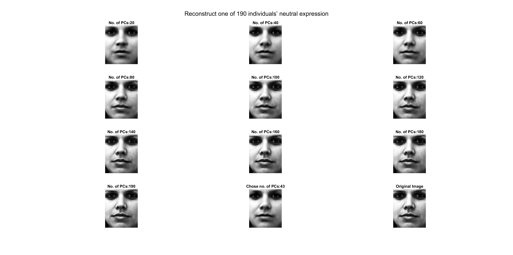
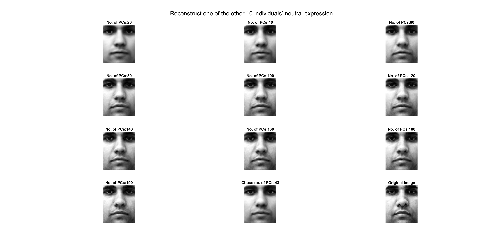

# Face-recognition
An approach to the detection and identification of human faces is implemented, and a working, near-real-time face recognition system which tracks a subject's head and then recognizes the person by comparing characteristics of the face to those of known individuals is described. This approach treats face recognition as a two-dimensional recognition problem, taking advantage of the fact that faces are normally upright and thus may be described by a small set of 2-D characteristic views. Face images are projected onto a feature space ('face space') that best encodes the variation among known face images. The face space is defined by the 'eigenfaces', which are the eigenvectors of the set of faces; they do not necessarily correspond to isolated features such as eyes, ears, and noses. Principal component analysis (PCA) is used on a collection of face images to form a set of basis features.

## Reference
* [M. A. Turk and A. P. Pentland, "Face recognition using eigenfaces," Proceedings. 1991 IEEE Computer Society Conference on Computer Vision and Pattern Recognition, Maui, HI, USA, 1991, pp. 586-591, doi: 10.1109/CVPR.1991.139758](https://doi.org/10.1109/CVPR.1991.139758)

## Results

  

  

